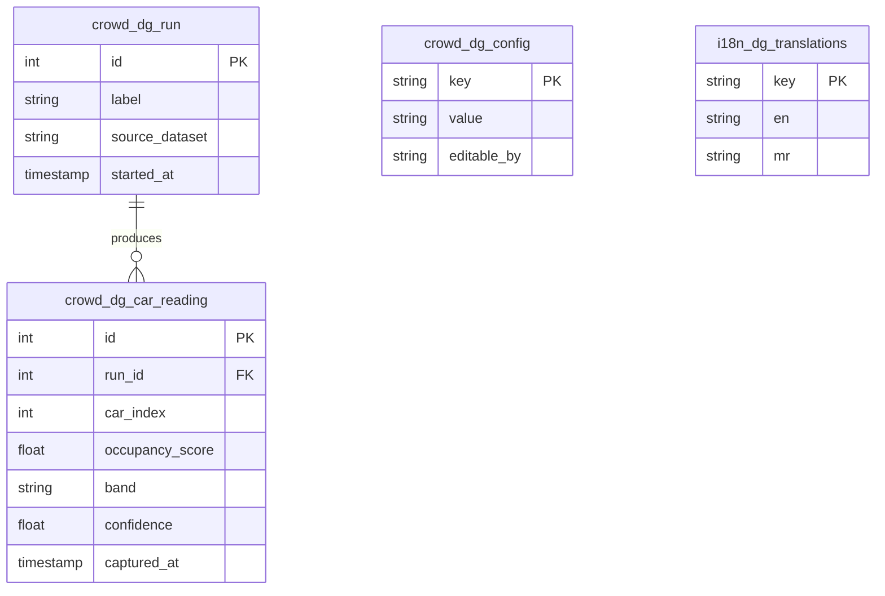
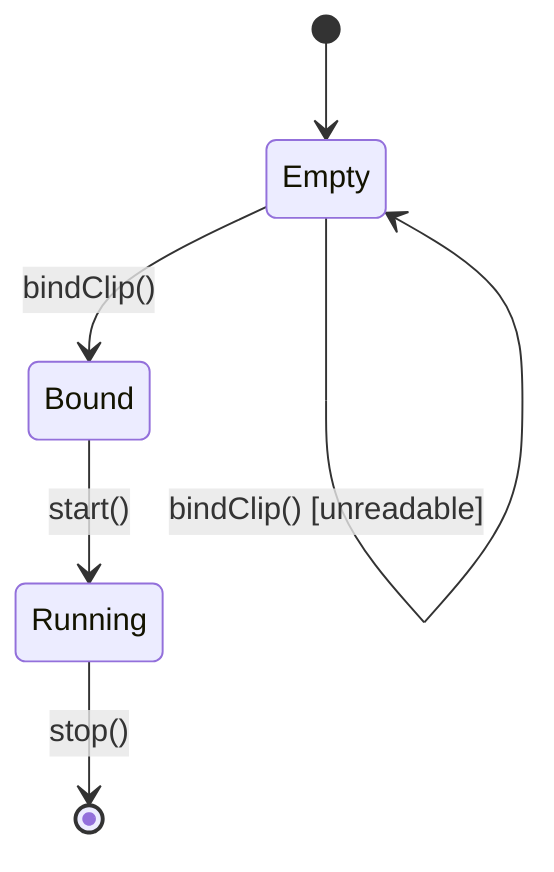
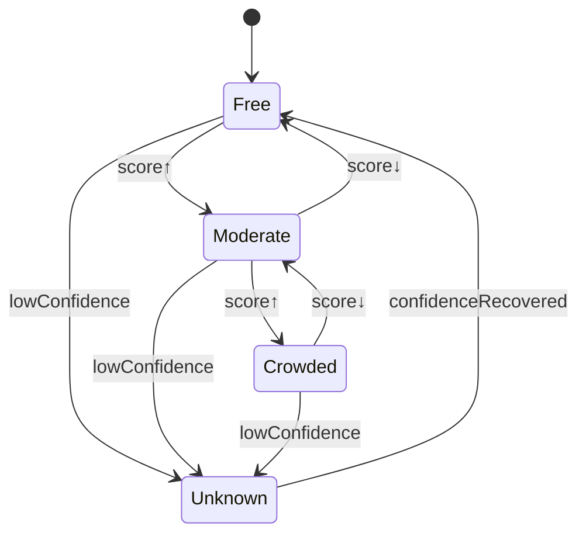
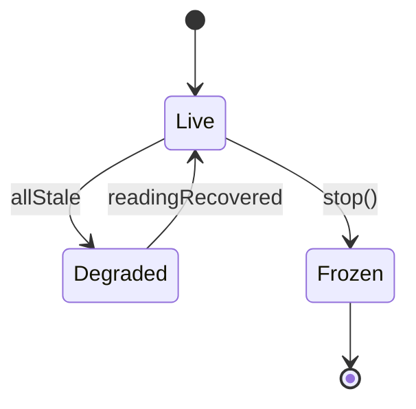

# AI Coach Crowd-Sensing — Proof of Concept — Functional Specification Document

**Version:** 1.0
**Date:** 16 July 2026
**Prepared by:** Stark Digital Media Services Pvt. Ltd.
**Client (prospect):** Pune Metro / Maha Metro (Maharashtra Metro Rail Corporation Ltd.)
**Target AI Agents / Developers:** Cursor, Claude, Copilot
**Status:** POC — internal demonstrator, not a production build

---

## ⚠️ Scope Boundary — READ FIRST

This FSD specifies a **proof-of-concept demonstrator only**. Its purpose is to prove the *concept* and produce a *client-facing demo*, and thereby earn a **paid validation pilot on Pune Metro's own CCTV feed**. It is explicitly **not** a validated, integrated, or production system.

**IN scope (this document):**
- Estimate coach crowd density as a **band** (Free / Moderate / Crowded) from video, using **public and analogous transit footage** — not Pune Metro footage.
- Map processed clips to simulated coaches and render a **passenger-facing platform density board** (bilingual EN/MR).
- Run fully **offline / on-prem**, with no external network calls (privacy posture built in from day one).

**OUT of scope (deferred to a later, separately-scoped production FSD):**
- Any use of Pune Metro's live or recorded CCTV (unavailable at POC stage for privacy reasons).
- Live train-to-platform signalling, PIDS/PIS integration, and per-car orientation-on-reversal mapping.
- HVAC / lighting control (rejected — CO₂ sensors are the cheaper, safety-certified path).
- Any accuracy, uptime, or savings guarantee for Pune Metro's environment.
- Exact headcount ("47 people"). The POC produces **bands, not counts**, by design.

> **Honest-claim rule for anyone demoing this:** say "concept demonstrated on public and analogous transit data — to be validated on your feed in a paid pilot." Never "our system counts your passengers."

---

## 1. Executive Summary

**Problem:** Platform ticketing gates give no visibility into how crowding is distributed *across coaches of a single train*, so passengers cannot choose a less-crowded coach and operations has no per-coach crowd signal.

**Solution:** A computer-vision pipeline that classifies in-coach video into a small set of occupancy **bands** and renders those bands, per coach, on a mock platform display — demonstrated on public/analogous footage, on-prem.

**Success Metric (POC — honest):**
1. A running demo that ingests analogous transit clips and displays live per-coach Free/Moderate/Crowded bands on a bilingual board; **and**
2. Band-agreement measured against a **hand-labeled holdout** and reported as-measured (no pre-asserted target); **and**
3. The demo is structured to convert into a scoped paid pilot on Pune Metro's real feed.

> The POC has *not* succeeded if it merely produces a good number on public data. It succeeds if it is a credible, honest instrument that opens the paid-pilot conversation.

---

## 2. System Configuration

*All values live in `crowd_dg_config` — never hardcoded. The band thresholds especially MUST be runtime-tunable, because they will be re-calibrated per camera/lighting when real footage becomes available.*

| Config Key | Default | Description | Editable By |
|------------|---------|-------------|-------------|
| `band_amber_threshold` | `0.35` | Occupancy score ≥ this → Moderate | Admin |
| `band_red_threshold` | `0.70` | Occupancy score ≥ this → Crowded | Admin |
| `frame_sample_rate_fps` | `2` | Frames per second sampled for inference | Admin |
| `smoothing_window_frames` | `6` | Temporal smoothing window to prevent band flicker | Admin |
| `inference_confidence_min` | `0.40` | Below this, emit `UNKNOWN` rather than a band | Admin |
| `board_staleness_timeout_sec` | `20` | Reading older than this → coach shows "Updating…" | Admin |
| `car_count` | `6` | Number of coaches rendered on the demo board | Admin |
| `model_variant` | `classifier` | `classifier` (primary) or `density_map` (comparison) | System |
| `default_locale` | `en` | Default board language | System |
| `supported_locales` | `en,mr` | Available locales | System |

---

## 3. Database Schema

*POC persistence is deliberately minimal — enough to drive and replay the demo. All tables use the `crowd_dg_` prefix per house standard.*



- `crowd_dg_run` — one demo run; records which analogous dataset/clip set drove it (for honest provenance).
- `crowd_dg_car_reading` — the per-coach band time series; powers both live board and replay.
- `band` ∈ `{FREE, MODERATE, CROWDED, UNKNOWN}`.

---

## 4. Feature Specifications

> One consolidated Dependency-Ordered Task List follows in §4.5, tagged by feature, in place of four near-duplicate per-feature lists (POC adaptation).

### 4.1 Clip Ingest & Coach Mapping

**FR-001:** Ingest an analogous transit video clip and bind it to a simulated coach index.
**User Story:** As a *demo operator*, I want to assign each source clip to a coach so that the board can show a realistic multi-coach train from footage I actually have.

#### State Transition Table

| Action | Precondition | Service Call | UI Reaction | New State | Hook Event |
|--------|--------------|--------------|-------------|-----------|------------|
| Select clip + coach index | Clip file readable | `ingestService.bindClip(carIndex, path)` | Coach tile shows clip thumbnail | `car[i] = 'Bound'` | `afterClipBind` |
| Select clip | File unreadable / bad codec | None | Inline error on tile; tile stays empty | `car[i] = 'Empty'` | `afterClipError` |
| Click "Start run" | ≥1 coach Bound | `runService.start(runLabel)` | Console → running; board activates | `run = 'Running'` | `afterRunStart` |
| Click "Start run" | 0 coaches Bound | None | Toast: "Bind at least one coach" | No change | None |

#### State Machine



---

### 4.2 Crowd Density Band Inference

**FR-002:** For each sampled frame, produce an occupancy score, map it to a band, temporally smooth it, and persist a per-coach reading.
**User Story:** As the *system*, I want to classify each coach's crowding into a band so that passengers and operators see an at-a-glance signal robust to occlusion.

**Method:** Primary path is a **frame-level occupancy classifier** (ViT/CNN) — validated as a viable approach in independent transit CCTV research and robust to the heavy occlusion that defeats head-counting in packed coaches. Optional comparison path is a **density-map estimator** (CSRNet-family) whose continuous density is binned into the same bands. Selected via `model_variant`. **Detection-and-count (YOLO-style) is deliberately not the primary method** — it degrades exactly when the coach is full, which is the case that matters most.

#### State Transition Table

| Action | Precondition | Service Call | UI Reaction | New State | Hook Event |
|--------|--------------|--------------|-------------|-----------|------------|
| Frame sampled | Run Running | `bandService.infer(frame)` | none (background) | `frame = 'Scored'` | `afterFrameScore` |
| Score ≥ `band_red_threshold` | Confidence ≥ min | `bandService.emit(car, 'CROWDED')` | Coach tile → red | `car.band = 'CROWDED'` | `afterBandEmit` |
| `amber` ≤ Score < `red` | Confidence ≥ min | `bandService.emit(car, 'MODERATE')` | Coach tile → amber | `car.band = 'MODERATE'` | `afterBandEmit` |
| Score < `band_amber_threshold` | Confidence ≥ min | `bandService.emit(car, 'FREE')` | Coach tile → green | `car.band = 'FREE'` | `afterBandEmit` |
| Any score | Confidence < `inference_confidence_min` | `bandService.emit(car, 'UNKNOWN')` | Coach tile → grey "—" | `car.band = 'UNKNOWN'` | `afterBandUnknown` |
| Reading age > `staleness_timeout` | — | `boardService.markStale(car)` | Coach tile → "Updating…" | `car.state = 'Stale'` | `afterBandStale` |

#### State Machine



---

### 4.3 Platform Density Board (Passenger-Facing)

**FR-003:** Render the live per-coach band for an N-coach train on a platform-style board, bilingual EN/MR, updating as readings arrive.
**User Story:** As a *commuter on the platform*, I want to see which coach is least crowded so that I can position myself before the train arrives.

#### State Transition Table

| Action | Precondition | Service Call | UI Reaction | New State | Hook Event |
|--------|--------------|--------------|-------------|-----------|------------|
| Board poll tick | Run Running | `boardService.getSnapshot()` | Tiles repaint to current bands | `board = 'Live'` | `afterBoardRefresh` |
| Language toggle EN⇄MR | Any | `i18nService.setLocale(loc)` | Labels + coach numbers switch script | `locale = loc` | `afterLocaleChange` |
| All coaches Stale/Unknown | — | `boardService.showBanner()` | Banner: "Live data unavailable" | `board = 'Degraded'` | `afterBoardDegraded` |
| Run stopped | Run Running | `boardService.freeze()` | Board dims; "Demo ended" | `board = 'Frozen'` | `afterBoardFreeze` |

#### State Machine



#### Devanagari Script Logic Block

*Required — the passenger board renders user-facing text and coach numbers in Marathi.*

```typescript
// libs/i18n/devanagari.config.ts
export const DEVANAGARI_CONFIG = {
  fontFamily: "'Noto Sans Devanagari', 'Mangal', 'Lohit Devanagari', sans-serif",
  fontWeight: { regular: 400, medium: 500, bold: 700 },
  lineHeight: 1.6,
  letterSpacing: '0.02em'
};

// Coach numbers on the board must localize (Car 3 → डबा ३)
const MARATHI_DIGITS = ['०','१','२','३','४','५','६','७','८','९'];
export function toMarathiNumbers(n: number | string): string {
  return String(n).replace(/[0-9]/g, d => MARATHI_DIGITS[+d]);
}
// toMarathiNumbers(3) → '३'
```

```css
.board-label { font-family: 'Noto Sans Devanagari', 'Mangal', sans-serif; line-height: 1.6; }
@media print { .board-label { font-family: 'Lohit Devanagari', 'Mangal', sans-serif; } }
```

**Band label localization (drives tile text and colour):**

| Band | Colour | EN | MR |
|------|--------|----|----|
| FREE | Green | Free | मोकळे |
| MODERATE | Amber | Moderate | मध्यम |
| CROWDED | Red | Crowded | गर्दी |
| UNKNOWN | Grey | — | — |

---

### 4.4 Demo Operator Console

**FR-004:** A minimal operator view to bind clips, start/stop a run, toggle `model_variant`, and adjust band thresholds live (to show the "banding is tunable" story in the room).
**User Story:** As the *presenter*, I want to nudge thresholds and swap the model live so that I can show the approach is honest and adjustable rather than a black box.

#### State Transition Table

| Action | Precondition | Service Call | UI Reaction | New State | Hook Event |
|--------|--------------|--------------|-------------|-----------|------------|
| Drag threshold slider | Run Running | `configService.set(key, val)` | Board re-bands live from stored scores | thresholds updated | `afterConfigChange` |
| Toggle model variant | Run stopped | `configService.set('model_variant', v)` | Console shows active model | `model_variant = v` | `afterModelSwitch` |
| Toggle model variant | Run Running | None | Toast: "Stop run to switch model" | No change | None |
| Click "Replay run" | A completed run exists | `runService.replay(runId)` | Board animates stored readings | `board = 'Replay'` | `afterReplayStart` |

---

### 4.5 Dependency-Ordered Task List (consolidated, feature-tagged)

**Phase 1 — Infrastructure**
- [ ] INFRA-01 [FR-001] Migration `crowd_dg_run` — columns: id, label, source_dataset, started_at
- [ ] INFRA-02 [FR-002] Migration `crowd_dg_car_reading` — columns: id, run_id, car_index, occupancy_score, band, confidence, captured_at
- [ ] INFRA-03 [ALL] Migration `crowd_dg_config` + seed defaults from §2
- [ ] INFRA-04 [FR-002] Index `idx_car_reading_run_car` on (run_id, car_index) for board queries
- [ ] INFRA-05 [FR-003] Seed `i18n_dg_translations` with keys in Appendix A

**Phase 2 — Contract**
- [ ] CONTRACT-01 [FR-002] Define `IBandService` — `infer(frame) → {score, confidence}`, `toBand(score) → band`
- [ ] CONTRACT-02 [FR-001] Define `IVideoSource` — `open(path)`, `readFrame() → frame | EOF`
- [ ] CONTRACT-03 [FR-003] `CarReadingDto`, `BoardSnapshotDto` (car_index, band, confidence, captured_at, is_stale)

**Phase 3 — Adapter** *(see Error Matrix §6)*
- [ ] ADAPTER-01 [FR-001] `VideoSourceAdapter` (OpenCV) — decode, sample at `frame_sample_rate_fps`, handle EOF/corrupt frames
- [ ] ADAPTER-02 [FR-002] `ModelInferenceAdapter` — load classifier (primary) / density-map (comparison) by `model_variant`; return score + confidence

**Phase 4 — Service**
- [ ] SERVICE-01 [FR-002] `BandService` — score → band via thresholds; apply `smoothing_window_frames`; emit UNKNOWN below confidence min
- [ ] SERVICE-02 [FR-001] `RunService.start/stop/replay`
- [ ] SERVICE-03 [FR-003] `BoardService.getSnapshot` + staleness marking
- [ ] SERVICE-04 [ALL] `ConfigService` reading/writing `crowd_dg_config` (live threshold + model switch)

**Phase 5 — Endpoint** *(local, no auth — POC on-prem, single operator)*
- [ ] ENDPOINT-01 [FR-003] `GET /api/v1/board` → current `BoardSnapshotDto[]`
- [ ] ENDPOINT-02 [FR-001] `POST /api/v1/run` → start run with clip→car bindings
- [ ] ENDPOINT-03 [FR-004] `PATCH /api/v1/config` → live threshold / variant updates

**Phase 6 — UI**
- [ ] UI-01 [FR-003] Platform board component implementing §4.3 State Transition Table; polls `GET /board`
- [ ] UI-02 [FR-003] Devanagari font fallback + `toMarathiNumbers` for coach numbers per Script Block
- [ ] UI-03 [FR-004] Operator console: clip binding, run controls, threshold sliders, model toggle
- [ ] UI-04 [FR-003] Register i18n keys (Appendix A)

**Phase 7 — Test / Validation**
- [ ] TEST-01 [FR-002] Unit: score→band mapping at threshold boundaries incl. UNKNOWN
- [ ] TEST-02 [FR-002] Determinism: same clip + config + seed → identical band series
- [ ] TEST-03 [FR-002] **Band-agreement on hand-labeled holdout — record and report the number as-measured (no target asserted)**
- [ ] TEST-04 [FR-003] Marathi rendering: labels + coach numbers via `toMarathiNumbers`
- [ ] TEST-05 [ALL] Confirm zero external network calls at runtime (on-prem / privacy posture)

---

## 5. API Specification

*Local single-node API for the demo. No authentication (on-prem, single operator, POC). This is a deliberate POC simplification and is called out as such — production would guard these.*

### 5.1 Board snapshot
**Endpoint:** `GET /api/v1/board`
**Success (200):**
```json
{ "success": true, "data": { "run_id": 12, "cars": [
  { "car_index": 1, "band": "FREE", "confidence": 0.82, "is_stale": false },
  { "car_index": 2, "band": "CROWDED", "confidence": 0.77, "is_stale": false }
] } }
```

### 5.2 Start run
**Endpoint:** `POST /api/v1/run`
**Request:**
```json
{ "label": "demo-1", "source_dataset": "mall+metro-yt", "bindings": [ { "car_index": 1, "clip": "clip_a.mp4" } ] }
```
**Success (201):**
```json
{ "success": true, "data": { "run_id": 12 }, "message": "Run started" }
```

### 5.3 Live config update
**Endpoint:** `PATCH /api/v1/config`
**Request:** `{ "band_red_threshold": 0.68 }`
**Success (200):** `{ "success": true }`

---

## 6. Adapter Error Matrix

| Adapter | Error Type | Trigger | Retry Strategy | Severity | Log Action | Feedback (EN) | Feedback (MR) |
|---------|------------|---------|----------------|----------|------------|---------------|---------------|
| `VideoSourceAdapter` | UnreadableFile | Bad path / codec | No retry | Critical | `error_dg_log` | "Clip cannot be read." | "क्लिप वाचता येत नाही." |
| `VideoSourceAdapter` | CorruptFrame | Single frame decode fail | Skip frame, continue | Info | `error_dg_log` | None (silent skip) | None |
| `VideoSourceAdapter` | EndOfStream | Clip ends | Loop or stop per run mode | Info | `audit_dg_log` | "Clip ended." | "क्लिप संपली." |
| `ModelInferenceAdapter` | ModelLoadFail | Weights missing / bad variant | No retry; halt run | Critical | `error_dg_log` + console alert | "Model failed to load." | "मॉडेल लोड होऊ शकले नाही." |
| `ModelInferenceAdapter` | LowConfidence | score below `inference_confidence_min` | No retry; emit UNKNOWN band | Warning | `error_dg_log` | Board shows "—" | "—" |
| `ModelInferenceAdapter` | LowLight/Glare | Frame quality below usable | Skip frame; if persistent → UNKNOWN | Warning | `error_dg_log` | Board shows "—" | "—" |

```typescript
protected async withGracefulSkip<T>(
  op: () => Promise<T>, onFail: (e: Error) => T
): Promise<T> {
  try { return await op(); }
  catch (e) { await this.logError(e); return onFail(e as Error); } // POC favours continuity over hard-fail on a single frame
}
```

---

## 7. Non-Functional Requirements (POC-appropriate)

| Category | Requirement | Target |
|----------|-------------|--------|
| Privacy | External network calls at runtime | **Zero** (fully on-prem/offline) |
| Privacy | Identity | Density banding only — **no face recognition, no re-identification, no PII stored** |
| Reproducibility | Same clip + config + seed | Identical band series |
| Responsiveness | Board refresh cadence (demo) | ≤ 2 s |
| Robustness | Behaviour on bad/low-light frame | Degrade to UNKNOWN, never crash |
| Localization | Languages | EN + MR (board + coach numbers) |
| Accuracy | Band-agreement vs hand-labeled holdout | **Measured and reported as-is — no target asserted at POC stage** |

---

## 8. Clarifications Needed

| # | Question | Impact if unresolved | Working Assumption |
|---|----------|----------------------|--------------------|
| 1 | Primary source dataset for the classifier? | Realism/credibility of the demo | Train/tune on **Mall** (indoor overhead) + a public **model-carriage boarding** set; use metro-interior clips as visual demo only, labelled "analogous" |
| 2 | How to calibrate band thresholds with no ground truth? | Band boundaries are judgement calls | Hand-label a small holdout to set defaults; expose thresholds in `crowd_dg_config` for live re-tuning |
| 3 | How many coaches on the board? | Board layout | 6 (`car_count`), matching a typical 3-car ×2 / 6-car metro rake — confirm actual Pune Metro rake length |
| 4 | Primary model — classifier or density-map? | Build effort / robustness | **Classifier primary**, density-map as an optional side-by-side comparison |
| 5 | Is metro-interior clip licensing acceptable for an internal demo? | Demo visuals | Use for internal presentation framing only; do not redistribute or train on as labelled data |

---

## Appendix A: i18n Keys

| Key | English | Marathi |
|-----|---------|---------|
| `board.title` | Live Coach Occupancy | थेट डबा गर्दी स्थिती |
| `board.car` | Coach | डबा |
| `board.stale` | Updating… | अद्ययावत होत आहे… |
| `board.unavailable` | Live data unavailable | थेट माहिती उपलब्ध नाही |
| `band.free` | Free | मोकळे |
| `band.moderate` | Moderate | मध्यम |
| `band.crowded` | Crowded | गर्दी |
| `common.demo_ended` | Demo ended | प्रात्यक्षिक संपले |

---

## Appendix B: Error Codes

| Code | Context | Description | Action |
|------|---------|-------------|--------|
| `VID_001` | VideoSource | Clip unreadable / bad codec | Show tile error; leave coach empty |
| `VID_002` | VideoSource | Single-frame decode fail | Skip frame, continue |
| `MDL_001` | Inference | Model weights load failure | Halt run; alert operator |
| `MDL_002` | Inference | Confidence below minimum | Emit UNKNOWN band |
| `CFG_001` | Config | Threshold out of [0,1] or amber ≥ red | Reject update; keep prior value |

---

## Appendix C: Explicit Out-of-Scope (Production Phase — separate FSD)

- Ingestion of Pune Metro live/recorded CCTV (requires the paid pilot + data agreement).
- Per-car → platform-position mapping including **train-orientation-on-reversal** at terminals.
- **PIDS/PIS integration** to drive real platform displays (latency-critical, integration-heavy — where naive per-car displays fail).
- HVAC/lighting control (rejected in favour of CO₂-sensor DCV).
- Calibrated accuracy claims, SLAs, uptime, or savings figures for Pune Metro.
- Authentication, multi-operator access, and hardened API guards.

---

## Revision History

| Version | Date | Author | Changes |
|---------|------|--------|---------|
| 1.0 | 16 Jul 2026 | Stark Digital (BAS) | Initial POC-scoped FSD |
